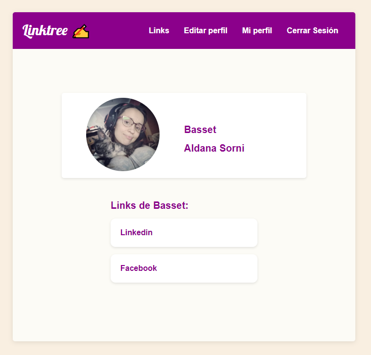
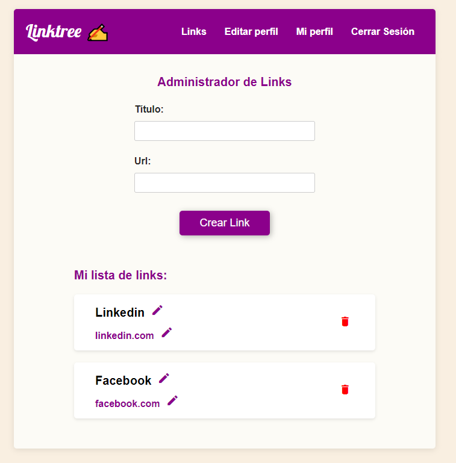
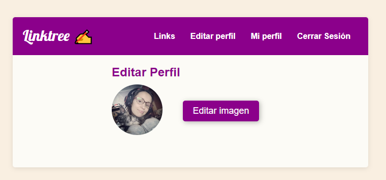
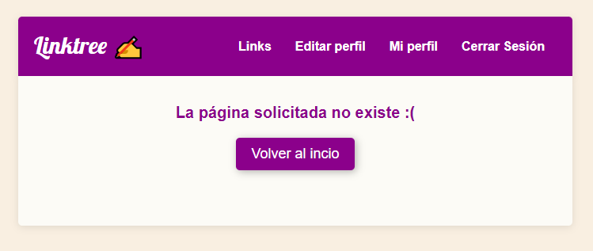

Les doy la bienvenida a éste nuevo proyecto que realicé :) 

## Descripción general:

Se trata de un gestor de links que permite al usuario tener sus links ordenados en un solo lugar. Ésta aplicación está construida con react y utiliza los servicios de storage, database y hosting de firebase. Para los estilos utilicé CSS puro y CSS modules. Mi principal objetivo con ésta aplicación fue, por una parte, repasar mis conocimientos en React. Por otra parte, aprender a utilizar los servicios de firebase para un proyecto significativamente más complejo que debo llevar a cabo ahora y será construido con éstas mismas herramientas. Espero les guste!

### 👉🏻 [Acceder a la aplicación](https://linktree-react-7af3b.web.app/)

## Funcionalidades:

### Autenticación:
-La aplicación permite al usuario crearse una cuenta iniciando sesión con una cuenta de Google. 

### Dashboard:
-En ésta sección se pueden crear los links, así como también editarlos y eliminarlos. Los links son almacenados en el servicio de firebase storage. 

### Editar Perfil: 
-En ésta sección se puede agregar una foto de perfil desde nuestro dispositivo. Para poder desarrollar ésta funcionalidad se utiliza el servicio de firebase storage.

### Perfil público: 
-En la sección "Mi perfil" se pueden ver los links, avatar y nombre del usuario, cualquier persona con ésta url podrá ver sus enlaces, dado que el perfil de cada usuario es público.

### 404:

-Al ingresar una URL que no sea válida, la aplicación mostrará un mensaje de error y te permitirá regresar al dashboard. 

Gracias por llegar hasta acá! Saludos :)
